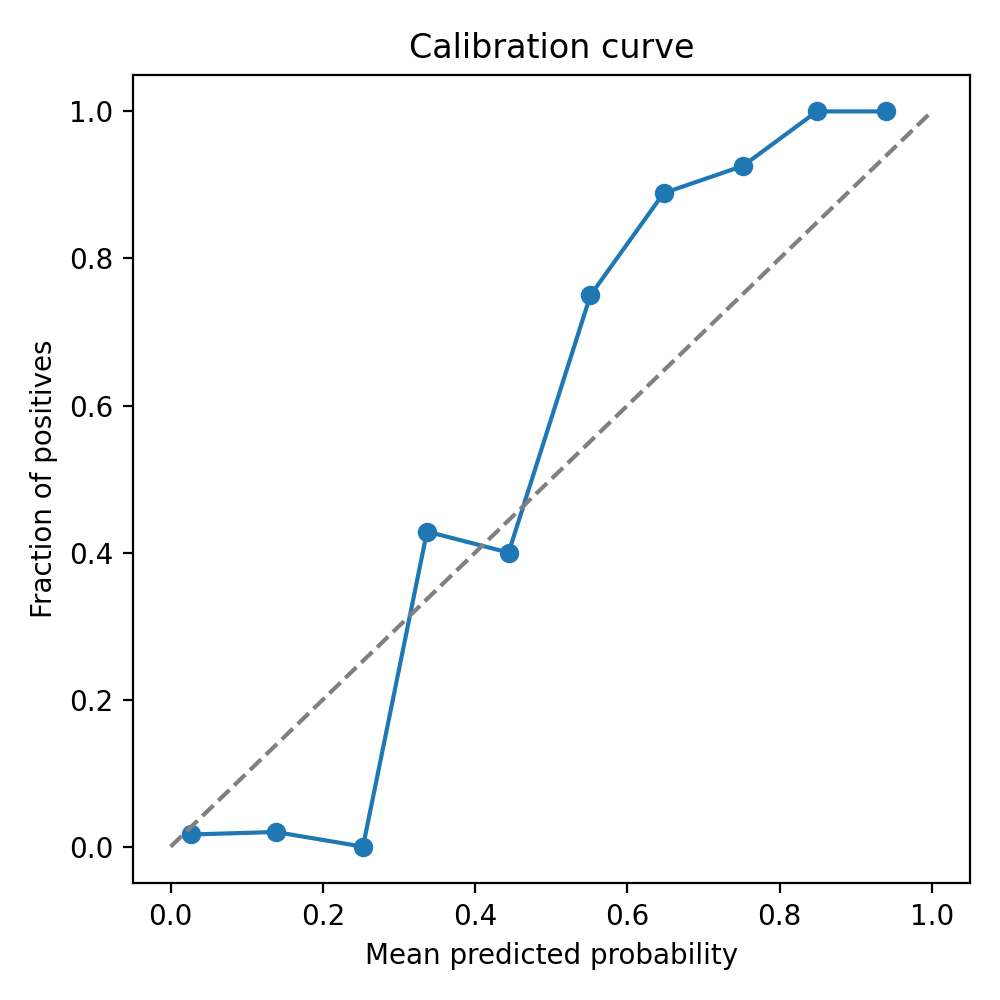
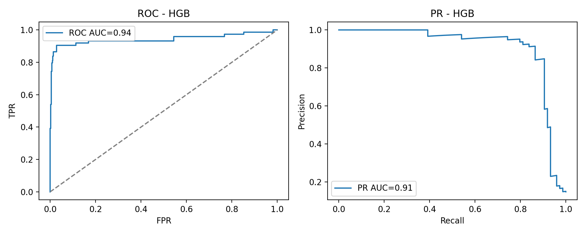

# HGSOC Drug Delivery Baseline

> **Synthetic educational demo** — do not use for clinical decisions.

## Summary metrics

| Model | ROC AUC | PR AUC | Brier |
|-------|---------|--------|-------|
| Logistic Regression | 0.760 | 0.357 | 0.204 |
| HistGradientBoosting | 0.943 | 0.907 | 0.036 |

Calibration slope=1.371, intercept=0.332.

## Fairness snapshot

- Subgroup Brier gap (stage/size): 0.058

See `reports/subgroup_table.csv` for per-group details.

## PK prior sensitivity

- Brier Δ (clearance −10%): 0.024
- Brier Δ (clearance +10%): 0.027

## Figures

## Limits

- Synthetic cohort; no validation on real HGSOC patients.
- Simplified PK/PD relationships; no inter-patient covariates beyond the simulated features.
- HistGradientBoosting is not calibrated for dosing recommendations; use temperature scaling for deployment.

## Next steps

1. Introduce external validation cohorts with heterogeneous imaging/PK priors.
2. Add Bayesian calibration and probabilistic sensitivity analysis for dosing.
3. Extend Streamlit app to explore subgroup explanations and uncertainty bands.
